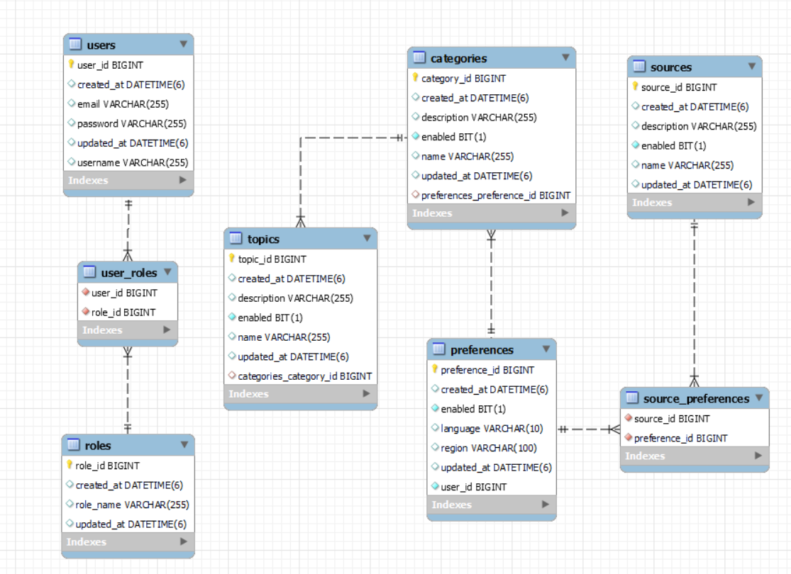

# News Aggregator Application

## Overview
The **News Aggregator Application** is a Spring Boot-based application that allows users to manage their news preferences, including categories, topics, and sources. It integrates with external news APIs to fetch and display news based on user preferences.

---

## Features
- **User Preferences Management**: Save, update, fetch, and delete user preferences for news categories, topics, and sources.
- **Integration with External APIs**: Fetch news from GNews and NewsAPI.
- **RESTful API**: Provides endpoints for managing preferences and fetching news.
- **H2 Database**: In-memory database for development and testing.
- **Swagger Documentation**: API documentation available via Swagger UI.

---

## Technologies Used
- **Java**: Programming language.
- **Spring Boot**: Framework for building the application.
- **Gradle**: Build tool.
- **H2 Database**: In-memory database for development.
- **JUnit 5**: Testing framework.
- **MockMvc**: For testing REST controllers.
- **Jackson**: JSON serialization/deserialization.

---

## Prerequisites
- **Java 17** or higher
- **Gradle 7.x** or higher

---

## Getting Started

### Clone the Repository
```bash
git clone https://github.com/shanmuka089/news-aggregator-api.git
```

### Navigate to the Project Directory
```bash
cd news-aggregator
```

### Build the Project
```bash
./gradlew clean build
```

### Run the Application
```bash
./gradlew bootRun
```

### Access Swagger UI
Open your browser and navigate to:
```
http://localhost:8080/swagger-ui.html
```

### Access H2 Console
Open your browser and navigate to:
```
http://localhost:8080/h2-console
```

### Database Design
